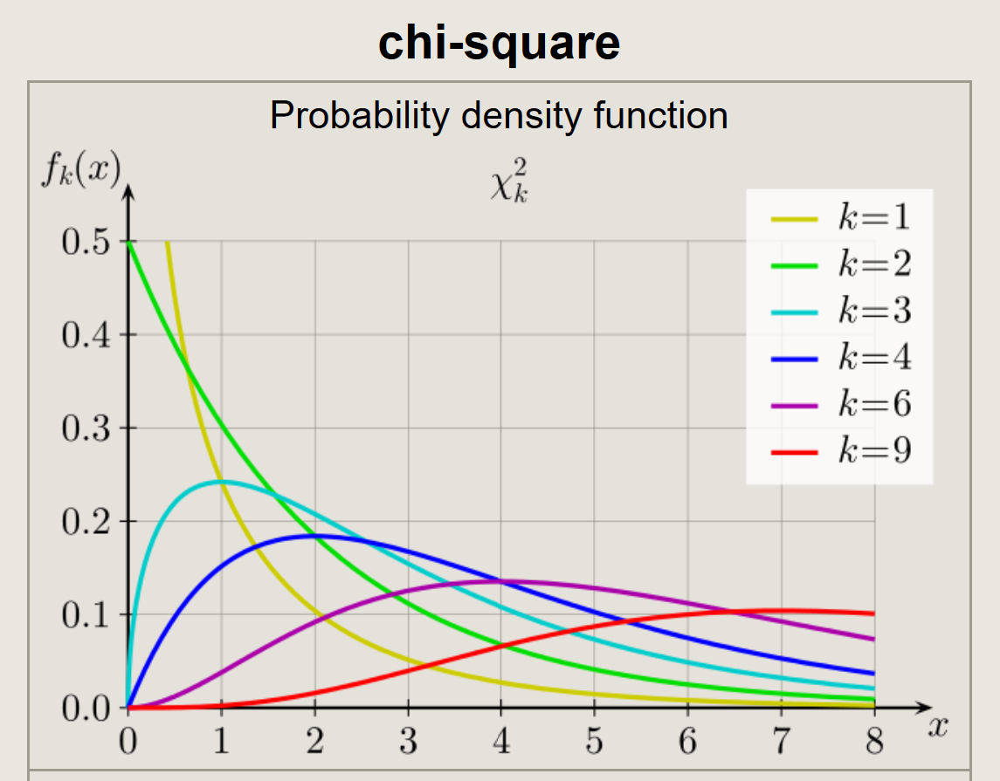

Last excercise we did:

  * Spoke about the R language and seen examples.
  * Reminded to go over basic probability distributions (Normal, Binomial, exc.)


Today's topics:

  1. Basic theory which will be the basis for the next weeks.
  2. Solve a question.

**HW 01 is out - submission in two weeks from now**


## Revision - the normal distribution - 
\[f\left(x | \mu, \sigma^{2}\right)=\frac{1}{\sqrt{2 \pi \sigma^{2}}} e^{-\frac{(x-\mu)^{2}}{2 \sigma^{2}}}\]


## Expectency and Variance of the sample sum (i.i.d)
i.i.d stands for independent and identically distributed random variables.
\[E\left(\sum_{i=1}^{n} X_{i}\right)=\sum_{i=1}^{n} E\left(X_{i}\right)= \sum_{i=1}^{n} \mu = n\mu \]

\[V\left(\sum_{i=1}^{n} X_{i}\right)=\sum_{i=1}^{n} V\left(X_{i}\right)= \sum_{i=1}^{n} \sigma^{2} = n\sigma^{2} \]

## Expectency and Variance of the sample mean (i.i.d)
\[E(\bar{X})=E\left(\frac{1}{n} \sum_{i=1}^{n} X_{i}\right)=\frac{1}{n} \sum_{i=1}^{n} E\left(X_{i}\right)=\frac{1}{n} \sum_{i=1}^{n} \mu=\frac{1}{n} \cdot n \mu=\mu\]


\[V(\bar{X})=V\left(\frac{1}{n} \sum_{i=1}^{n} X_{i}\right)=\frac{1}{n^{2}} \sum_{i=1}^{n} V\left(X_{i}\right)=\frac{1}{n^{2}} \sum_{i=1}^{n} \sigma^{2}=\frac{1}{n^{2}} \cdot n \sigma^{2}=\frac{\sigma^{2}}{n}\]

## Bias variance decomposition 
\[\operatorname{MSE}(\hat{\Theta})=E(\hat{\Theta}-\theta)^{2}\]
\[ \operatorname{MSE}(\boldsymbol{\hat{\Theta}})=E[\boldsymbol{\hat{\Theta}}-E(\boldsymbol{\hat{\Theta}})]^{2}+[\theta-E(\boldsymbol{\hat{\Theta}})]^{2}\]
\[=V(\hat{\Theta})+(\text { bias })^{2}\]

The MSE of an estimator is a criterion in choosing the best estimator:

  * If the estimator is unbiased it doesn't mean that it has the lowest MSE

***  
The distribution of a sample (i.i.d) from the normal distribution (on board).
***


## Central limit theoram 
Let there be n random variable such that - 
\[E(X_i) = \mu,V(X_i) = \sigma \]
Than, for a large n:
\[\sum_{n} X_{i} \sim N\left(n \mu, n \sigma^{2}\right)\]
\[\bar{X} \sim N\left(\mu, \frac{\sigma^{2}}{n}\right)\]


If $X_i$ is distributed normal than it accounts for every n.

## Deriving an unbiased estimate for $\sigma^{2}(S^{2})$ - 

\[E\left(S^{2}\right)=E\left[\frac{\sum_{i=1}^{n}\left(X_{i}-\bar{X}\right)^{2}}{n-1}\right]=\frac{1}{n-1} E \sum_{i=1}^{n}\left(X_{i}-\bar{X}\right)^{2}\]

\[=\frac{1}{n-1} E \sum_{i=1}^{n}\left(X_{i}^{2}+\bar{X}^{2}-2 \bar{X} X_{i}\right)=\frac{1}{n-1} E\left(\sum_{i=1}^{n} X_{i}^{2}-n \bar{X}^{2}\right)\]

\[=\frac{1}{n-1}\left[\sum_{i=1}^{n} E\left(X_{i}^{2}\right)-n E\left(\bar{X}^{2}\right)\right]\]

Recall from the probability course - 
\[V(X) = E(X^2) - [E(X)]^2\]
We can deduce that $E\left(X_{i}^{2}\right)=\mu^{2}+\sigma^{2}$ and $E(\bar{x}) =\mu^{2}+\sigma^{2} / n$
So - 
\[E\left(S^{2}\right)=\frac{1}{n-1}\left[\sum_{i=1}^{n}\left(\mu^{2}+\sigma^{2}\right)-n\left(\mu^{2}+\sigma^{2} / n\right)\right]\]
\[=\frac{1}{n-1}\left(n \mu^{2}+n \sigma^{2}-n \mu^{2}-\sigma^{2}\right) = \sigma^{2} \]


# Some distribuitons that we will use in the future

## Student's t-distribution
In probability and statistics, Student's t-distribution (or simply the t-distribution) is any member of a family of continuous probability distributions that arises when estimating the mean of a normally distributed population in situations where the sample size is small and the population standard deviation is unknown. It was developed by William Sealy Gosset under the pseudonym Student. 
when n < 30 it resembles the nurmal distribution and when n >= 30 it is very close to it (especially when n increases)

```{r T, echo=FALSE, out.width = '50%'}
knitr::include_graphics(knitr::include_graphics('t.png'))
```


## The chi squared distribution
In probability theory and statistics, the chi-square distribution (also chi-squared or χ2-distribution) with k degrees of freedom is the distribution of a sum of the squares of k independent standard normal random variables. The chi-square distribution is a special case of the gamma distribution and is one of the most widely used probability distributions in inferential statistics, notably in hypothesis testing or in construction of confidence intervals.

```{r X^2, echo=FALSE, out.width = '50%'}
knitr::include_graphics()
```
\
**We will also use the F distribution**

# Q1 & Q2 - Attached in PDF


