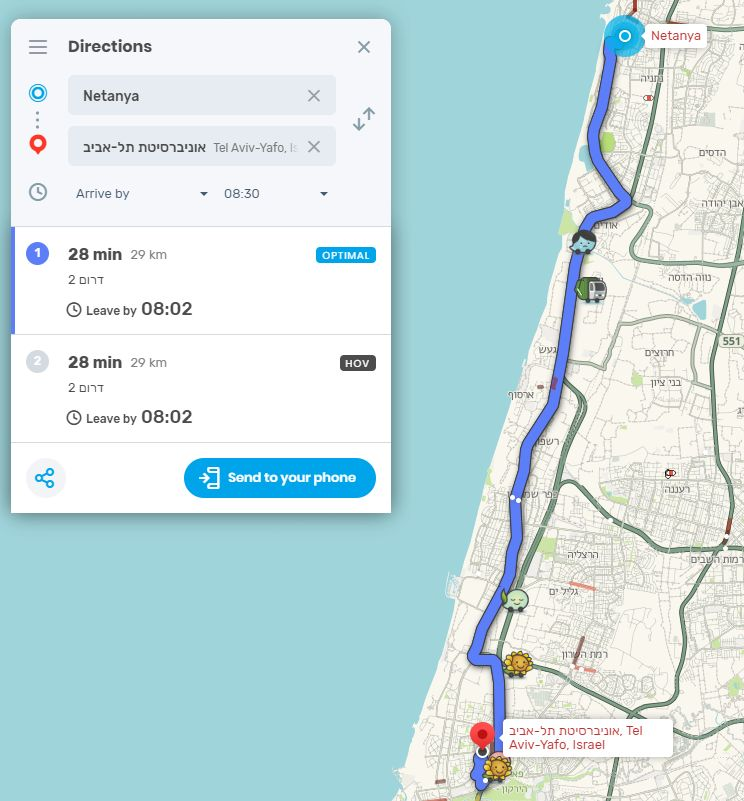

```{css, echo = FALSE}
.remark-slide-content {
  font-size: 28px;
  padding: 20px 80px 20px 80px;
}
.remark-code, .remark-inline-code {
  background: #f0f0f0;
}
.remark-code {
  font-size: 24px;
}
.huge .remark-code { /*Change made here*/
  font-size: 200% !important;
}
.tiny .remark-code { /*Change made here*/
  font-size: 50% !important;
}

.small .remark-code {
   font-size: 75% !important;
}

.remark-slide-content {
    font-size: 20px;
    padding: 1em 4em 1em 4em;
}

table { display: inline-block; }

th, td {
   padding: 5px;
}

small-slide {
   font-size: 70% !important;
}

.image-50 img {
  display: block;
  margin-left: auto;
  margin-right: auto;
  width: 50%;
}

.right-plot {
  width: 60%;
  float: right;
  padding-left: 1%;
}
```

```{r setup, include=FALSE}
options(htmltools.dir.version = FALSE, fig.width = 3, fig.height = 3)
knitr::opts_chunk$set(fig.dim=c(3, 3), fig.align = "center")
library(tidyverse)
```

# Reminder from previous lecture

Last lesson we talked about:

--

   * Biased/unbiased estimators, variance of estimators (and standard errors)

--

   * We discussed three methods of estimation
   
      1. Maximum Likelihood Estimation (MLE) $L(\theta)=\prod_i{f(x_i;\theta)}$; examples: Poisson, Normal.
      
      2. Bayesian method $\pi(\theta|x)=\frac{f(x|\theta)\pi(\theta)}{\int{f(x|\theta)\pi(\theta)}d\theta}$; examples: discrete/uniform for estimating a population proportion
      
      3. The moment method (use $EX^k=\sum{x_i^k}$ across $k=1,2,\ldots$)
   
--

   * The central limit theorem: $Z=\frac{\bar{X}-\mu}{\sigma/\sqrt{n}}$ converges to a normal disribution

--

   * We started talking about statistical intervals $P(\hat{\Theta}_l<\theta<\hat{\Theta}_u)=1-\alpha$
   
---

# Statistical Intervals (Montgomery chapter 8)

We discussed point estimates, however

   * Even if everything works "properly" (a random sample, unbiased estimator), it is unlikely that we will reach the exact parameter value
   
   * As the sample increases accuracy improves; but

--
   
   * Sometimes we are interested in a *Confidence Interval*
   
   * An interval of the form $\hat{\Theta}_l < \theta < \hat{\Theta}_u$ where 

--
   
   * The lower and upper bounds $\hat{\Theta}_l, \hat{\Theta}_u$ depend on the statistic $\hat{\Theta}$

--

In a probabalistic notation, we are looking for $\hat{\Theta}_l, \hat{\Theta}_u$ such that:

$$P(\hat{\Theta}_l < \theta < \hat{\Theta}_u) = 1-\alpha$$

For $\alpha\in(0,1)$. For example, when we set $\alpha=0.05$, we call this a 95% confidence interval for $\theta$.

---

# Motivation (example) road trippin' (1/3)

   * Let's say we're planning a logistic operation 
   
--
   
   * We need to be in a specific place at a specific time

--
   
   * We must not be late, but we can be a little early

--

   * When should we depart?

---

# Motivation (example) road trippin' (2/3)

Waze is cool, but... [https://www.waze.com/livemap](https://www.waze.com/livemap)

   * Not very robust for advance planning

   * Specifically, we're only seeing a point estimate (average arrival time?) and not the distribution
   
   * It's not that accurate either (30min to TLV in the rush hour?)
   
.image-50[

]

---

# Motivation (example) road trippin' (3/3)

.small-slide[
Assume we have Waze's raw data (needs to be **focused on the relevant time**, unbiased sample). We can compute a confidence interval.
]
.small[
```{r example for distribution of drive duration}
set.seed(0)
drive_time <- tibble(duration = rexp(100, rate = 1/65))
# the rate is 1/65 cars per min. It means that it takes 65 minutes to get through
```
]
.right-plot[
```{r plot the exp dist, echo=FALSE}
ggplot(drive_time, aes(x = duration)) +
   geom_histogram(bins = 15) +
   theme_bw()
```
]
.small[
```{r t test results for drive duration}
t.test(drive_time$duration, 
       alternative = "two.sided", 
       mu = mean(drive_time$duration))

```
]

To be 95% sure, we need to plan for **80 minutes' drive**.

---

# Confidence Interval for Normal Distribution with Known Variance

We previously mentioned the central limit theorem and that 

$$Z = \frac{\bar{X}-\mu}{\sigma/\sqrt{n}}$$

Is normally distributed as $n\rightarrow\infty$. Hence:

$$P(z_{\alpha/2} < Z < x_{1-\alpha/2}) = 1-\alpha$$

--

$$P(z_{\alpha/2} < \frac{\bar{X}-\mu}{\sigma/\sqrt{n}} < z_{1-\alpha/2}) = 1-\alpha$$

--

Using the fact that for the normal distribution $z_{1-\alpha/2}=-z_{\alpha/2}$:

$$P(\bar{X} - z_{\alpha/2}\frac{\sigma}{\sqrt{n}} < \mu < \bar{X} + z_{\alpha/2}\frac{\sigma}{\sqrt{n}}) = 1-\alpha$$

---

# Confidence Interval for Normal Distribution with Unknown Variance

In this case, we use our estimator $S$ to compute our statistic and confidence interval.

$$T = \frac{\bar{X}-\mu}{S/\sqrt{n}}$$

The statistic $T$ has a student's t-distribution with $n-1$ degrees of freedom. I.e.:

$$P(-t_{\alpha/2,n} < T < t_{\alpha/2,n})=1-\alpha$$

.center[
```{r example for the t distribution, echo = F, fig.dim=c(7,4)}

t_dist_example <- tibble(x = -seq(-10, 10, 0.1)) %>% 
   mutate(t01 = dt(x, df = 1),
          t05 = dt(x, df = 5),
          t10 = dt(x, df = 10),
          norm = dnorm(x, mean = 0, sd = 1)) %>% 
   pivot_longer(cols = -x, names_to = "distribution", values_to = "y")

ggplot(t_dist_example, aes(x, y, color = distribution, linetype = distribution)) + 
   geom_line(size = 0.8) + 
   theme_bw()

```
]

---

# Back to the drive duration example

In the previous example we used `t.test`, let's break it down.
.small[
```{r waze example detailed computation}
n <- NROW(drive_time)

# t.test(drive_time$duration, 
#        alternative = "two.sided", 
#        mu = mean(drive_time$duration))

mean_duration <- mean(drive_time$duration)
sd_duration <- sd(drive_time$duration)
t_test_lims <- qt(p = c(0.025, 0.975), df = 99)

# This time, manually computed

mean_duration + t_test_lims*sd_duration/sqrt(100)

```
]

---

# Determining the sample size from a desired confidence range

If we want to have a confidence interval with a range not exceeding $\pm r$, we can use:

$$\bar{X}+z_{\alpha/2}\frac{\sigma}{\sqrt{n}}-\left(\bar{X}-z_{\alpha/2}\frac{\sigma}{\sqrt{n}}\right) \leq 2r$$

--

Then,

$$\sqrt{n}\geq z_{\alpha/2}\frac{2\sigma}{2r}$$

--

$$n\geq \left(z_{\alpha/2}\frac{\sigma}{r}\right)^2$$

--

Or (if variance is unknown):

$$n\geq \left(t_{\alpha/2,\operatorname{n-1}}\frac{S}{r}\right)^2$$

Ever wondered why surveys have $n=500$ respondents? it comes from a $\pm 4.4\%$ margin of error with a $95\%$ confidence interval (using a binomial distribution). 

Maybe in the next homework.

---

# What sample do we need in order to have a range $r$ for the drive duration?

We want to have a 95% confidence interval in the drive duration, which is not longer than $\pm4$ minutes, i.e., $2r=8$ minutes.
.tiny[
```{r compute sample size for a 10 min duration}
{{desired_n <- ((qt(p = 0.975, df = 99))*sd_duration/ 4 )^2}}
desired_n

set.seed(0) # illustration that this works
drive_time <- tibble(duration = rexp(desired_n, rate = 1/65))
t.test(drive_time$duration, 
       alternative = "two.sided", 
       mu = mean(drive_time$duration))
```
]