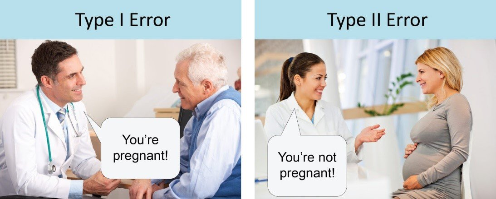

```{css, echo = FALSE}
.remark-code, .remark-inline-code {
  background: #f0f0f0;
}
.remark-code {
  font-size: 24px;
}

.huge { 
  font-size: 200%;
}
.tiny .remark-code {
  font-size: 50%;
}

.small .remark-code{
   font-size: 85% !important;
}

.small {
   font-size: 85% !important;
}

.remark-slide-content {
    font-size: 20px;
    padding: 1em 4em 1em 4em;
}

table { display: inline-block; }

th, td {
   padding: 5px;
}

.small-slide {
   font-size: 70% !important;
}

.image-50 img {
  display: block;
  margin-left: auto;
  margin-right: auto;
  width: 50%;
}

.right-plot {
   width: 60%;
   float: right;
   padding-left: 1%;
   bottom: 0px;
   right: 0px;
   position: absolute;
}


```

```{r setup, include=FALSE}
options(htmltools.dir.version = FALSE, fig.width = 3, fig.height = 3)
knitr::opts_chunk$set(fig.dim=c(3, 3), fig.align = "center")
library(tidyverse)
library(countdown)
```

# Reminder from previous lecture

Last lesson we talked about:

--

   * Confidence intervals, i.e.:
   
$$P(\bar{X} - z_{\alpha/2}\frac{\sigma}{\sqrt{n}} < \mu < \bar{X} + z_{\alpha/2}\frac{\sigma}{\sqrt{n}}) = 1-\alpha$$

--

   * We've seen confidence intervals for
   
      * Normal distribution (for $\mu$ and for $\sigma$)
      
      * Using Student's T (variance unknown)
      
      * Binomial case (the election survey example)
      
$$\hat{p}\pm \frac{z_{\alpha/2}}{2\sqrt{n}}$$

--

   * Setting the sample size according to a confidence interval length, e.g.:
   
$$n\geq \left(z_{\alpha/2}\frac{\sigma}{r}\right)^2$$

   * Prediction intervals
   
      * Used when we want to express the uncertainty of the *next observation*

$$\bar{X}-t_{\alpha/2,n-1}\times s\sqrt{1+\frac{1}{n}}\leq x_{n+1} \leq \bar{X} + t_{\alpha/2,n-1}\times s\sqrt{1+\frac{1}{n}}$$

---

# Hypothesis testing (Montgomery chapter 9)

A *statistical hypothesis* is a statement about the parameters of one or more populations.

--

In empirical research, we first formulate our hypothesis, and then we try to find empirical results to support our hypothesis (never the other way around, that's called HARK-ing).

--

For example:

  * $H_0$: The average time to reach TLV from Netanya $=$ 40 minutes
  
  * $H_1$: The average time to reach TLV from Netanya $\neq$ 40 minutes 
  
--
  
The $H_0$ is called the *null hypothesis* and the $H_1$ is called the *alternative hypothesis*.

--

The same situation can be descrived with different hypothesis (with a different meaning):

  * $H_0$: The average time to reach TLV from Netanya $=$ 40 minutes
  
  * $H_1$: The average time to reach TLV from Netanya $>$ 40 minutes

--

Today we will discuss how to devise hypothesis tests, what are type-I and type-II errors, what is the meaning of rejecting a null hypothesis, what are p-values and what is the connection to the statistical intervals we were discussing.

---

# First - an example

Scan the following QR code (or visit the link) and answer the survey.

[http://bit.ly/att_flu_ex](http://bit.ly/att_flu_ex)


```{r counter for survey, echo = F}
countdown(minutes = 5, play_sound = FALSE)
```

--

This is a copy of a true survey used in a research I did with a collegue.

   * What do you think were our hypothesis in this survey?
   
   * What were we trying to accomplish?

---

# The Attractive Flu Shot (1/2)

The survey has a number of versions, rendered to respondents randomly. There are five groups:

   * Control (a "regular" message from the HMO)
   
   * Recommendation (for effectiveness of the shot, the health ministry recommends to take it early)
   
   * Stock (if you don't take an early shot, the stock may run out)
   
   * Cost (the shot would cost for patients taking it after December)
   
   * Benefit (if you take an early shot, you get some kind of incentive)

--

This psychological nudge leverages the *attraction effect*, i.e.: options *A* and *B* are not comparable, but when decoy *b* is added, and is comparable to *B*, we tend to choose *B* over *A*.

```{r nudge example, echo=FALSE, fig.dim=c(5,3)}
tribble(~option, ~value1, ~value2,
        "A", 1, 2,
        "B", 2, 1,
        "b", 2, 0.5) %>% 
   ggplot(aes(value1, value2, label = option, color = option)) + 
   geom_point() + 
   geom_label() +
   theme_bw() + 
   coord_cartesian(xlim = c(0.5,2.5), ylim = c(0,2.5))
```

---

# The Attractive Flu Shot (2/2)

If you read Dan Arieli's books, you probably read about attraction.

We have a lot of hypothesis in this research, but here is an example (the treatment increases vaccination intentions):

   * Recommendation treatment:
       
      * $H_0$: $p_{\text{control}}=p_{\text{recommendation}}$
      * $H_1$: $p_{\text{control}}<p_{\text{recommendation}}$

--

   * Stock treatment:
   
      * $H_0$: $p_{\text{control}}=p_{\text{stock}}$
      * $H_1$: $p_{\text{control}}<p_{\text{stock}}$

--
      
   * You get the hang of it...
   
--

Additional hypothesis deal with the interaction of *certainty* and the attraction effect's influence.

---

# Back to theory of hypothesis testing

Let's simplify things: say that the percent of patients taking flu vaccinations is about 20% (known based on previous years). We want to see if our experiment led to an increase in that percent, that is *significantly* higher.

   * $H_0$: $p_\text{treatment} = 0.2$
   
   * $H_1$: $p_\text{treatment} > 0.2$
   
--

What would you say if we measure after the intervention the following rates...?

   * $\hat{p} = 0.19$

--

   * $\hat{p} = 0.60$

--
   
   * $\hat{p} = 0.25$
   
--

We need a clear statistical *criteria* for deciding what is significant and what is not.

--

class: small-slide

```{r binomial distribution and criteria, echo = FALSE, fig.dim=c(4.5,4.5)}

binomial_dist <- tibble(x = seq(0, 100, 1)) %>% 
   mutate(binom_dens = dbinom(x, size = 100, prob = 0.2))

ggplot(binomial_dist, aes(x = x, y = binom_dens)) + 
   geom_line() + 
   geom_vline(xintercept = 19, color = "red") + 
   geom_vline(xintercept = 25, color = "darkgreen") + 
   geom_vline(xintercept = 60, color = "darkblue") + 
   theme_bw()

```

---

# Two types of errors

In order to set a decision rule, we need to consider two types of errors:

   * **Type-I** error (aka False-positive): **rejecting** $H_0$ when it is **true**.
   
   * **Type-II** error (aka False-negative): **failing** to reject $H_0$ when it is **false**.
   
--

In medical decision making, this would look like $H_0$: not pregnant
.image-50[

]
[(source)](http://www.statisticssolutions.com/to-err-is-human-what-are-type-i-and-ii-errors/])

---

# Tradeoff between type-I and type-II errors

### Type-I error

The type-I error is also called the *significance level*, or $\alpha$-error.

$$\alpha = P(\text{Reject } H_0| H_0 \text{ True})$$

```{r countdown for zero type I err, echo=F}
countdown(minutes = 1, top = 0)
```

Questions:

   * In the pregnancy classification example, what is an $\alpha=0$ decision rule?
   
   * In the flu vaccination example, what is an $\alpha=0$ decision rule?
   
--

Answers:

   * Always classify: not pregnant
   
   * Reject $H_0$ when $\hat{p}=\pm\infty$ (i.e. never reject $H_0$)

--

### Type-II error

As the type-I error decreases the decision rule tends to prefer not rejecting $H_0$ which leads to a higher type-II error

$$\beta=P(\text{Fail to reject } H_0| H_1 \text{ True})$$

---

# General framework for hypothesis testing

This is the procedure for hypothesis testing:

   1. Identify the parameter of interest (i.e., proportion, expectancy, std, etc.)
   
   2. State the null hypothesis $H_0$
   
   3. Specify the alternative hypothesis $H_1$ (one sided, two sided, etc.) 
   
   4. Choose significance level $\alpha$
   
   5. Determine what test statistic to use (e.g., $Z, T, X^2$)
    
   6. State the rejection region for the statistic
   
   7. Compute the sample quantities, plug-in into the test statistic and compute it
   
   8. Decide if $H_0$ should be rejected based on 6-7
   
--

Steps 1-4 must be done before starting the research (a-priori and not posteriori, we'll see why later on)

---

# Example for attraction effect hypothesis test decision rule (computation)

Let's create an $\alpha=0.05$ decision rule for classifying if the attraction effect worked in our experiment.

--

.small[
  * The parameter is $p$ (vaccinations after intervention)
]
.small[
  * $H_0$: p = 0.2 (no attraction effect)
]
.small[
  * $H_1$: p > 0.2 (interevntion was successful)
]
.small[
  * $\alpha = 0.05$
]

--

.small[
   
   * The test statistic
   
$$z_0 = \frac{x-np_0}{\sqrt{np_0(1-p_0)}}$$

   * Reject $H_0$ if $z_0>z_{1-\alpha}=1.96$
   
   * Compute $z_0$, given experiment results: $x=29$ successes, $n = 100$ subjects
   
$$z_0 = \frac{29-100\times0.2}{\sqrt{100\times0.2\times0.8}}=2.25>1.96 = z_{0.95}$$
]

--

.small[

   * Conclusion: we reject $H_0$, and therefor claim that the experiment nudged patients to vaccinate.
]

---
   
# Example for attraction effect hypothesis test decision rule (code)

.small[
In R, we have a number of functions for this specific test. The previous computation is an **apporximation** (doesn't work for small $n$ or extreme $p$). R can compute an approximate or an exact test.
]

.tiny[
```{r example for binom test}

prop.test(x = 29, n = 100, p = 0.2, alternative = "greater")

binom.test(x = 29, n = 100, p = 0.2, alternative = "greater")

```
]

---

# P-value versus specified $\alpha$ value

The results in R do not state a specific $z_0$ but rather a **p-value**. What does p-value mean?

   * By stating "we reject $H_0$ at the $\alpha$ level" we're omitting important information:

      * How "significant" is our rejection? 
      * Would this rejection hold when we vary $\alpha$? i.e.: Would our rejection hold at $\alpha=0.03$? $\alpha=0.0001$?

--

* The p-value is the smallest level of significance that would lead to rejection of the null hypothesis $H_0$ with the given data.

--

$$z_0 = \frac{29-100\times0.2}{\sqrt{100\times0.2\times0.8}}=2.25>1.65 = z_{0.95} = z_{1-\alpha}$$

As long as $z_{1-\alpha}$ < 2.25 we would still reject $H_0$. Hence, the p-value is:

$$\text{p-value}=1-\Phi(z_0=2.25) = 0.012$$

.small[
```{r computing p value for normal dist}
1-pnorm(q=2.25)
```
]

---

# Type-II error and determining the sample size (1/3)

So far, we've only considered the choice of $\alpha$, i.e., the type-I error. However, we can also influence $\beta$ by choice of the sample size $n$ (and sometimes also by the type of test - *out of scope*).

Let's see how change in $n$ can increase the power (decrease the type-II error, $\beta$).

--

In our example, we had $p_0=0.2$, let's assume now that in the alternative hypothesis we use $p_1=p_0+\delta$ (one sided "greater than" test).

--

$$\beta=P(\text{Not rejecting } H_0 | H_1 \text{ true}) = P\left(\frac{x-np_0}{\sqrt{np_0(1-p_0)}}\leq z_{1-\alpha} | p_1=p_0+\delta\right)$$

--

Note that

$$Z_0=\frac{x-np_0}{\sqrt{np_0(1-p_0)}}=\frac{x-(np_0 + n\delta)}{\sqrt{np_0(1-p_0)}} + \frac{\delta\sqrt{n}}{\sqrt{p_0(1-p_0)}}$$

Given $H_0$, the distribution of $Z_0\sim\mathcal{N}\left(\delta\sqrt{n/p_0(1-p_0)}, 1\right)$, hence

---

# Type-II error and determining the sample size (2/3)

$$\beta = P\left(\frac{x-(np_0+n\delta)}{\sqrt{np_0(1-p_0)}}<z_{1-\alpha} - \frac{\delta\sqrt{n}}{\sqrt{p_0(1-p_0)}} | p_1=p_0+\delta\right) =$$ 
$$=P\left(\frac{x-(np_0+n\delta)}{\sqrt{n(p_0+\delta)(1-p_0-\delta)}}<\frac{z_{1-\alpha}\sqrt{np_0(1-p_0)}-\delta n}{\sqrt{n(p_1+\delta)(1-p_1-\delta)}}\quad|\quad p_0+\delta\right)$$

$$\beta=\Phi\left(\frac{z_{1-\alpha}\sqrt{np_0(1-p_0)}-\delta n}{\sqrt{n(p_0+\delta)(1-p_0-\delta)}}\right)$$

Now we can use `qnorm(beta)`, i.e.: $\Phi^{-1}(\beta)$, and given $\beta$, $p_0$, $\delta$ compute $n$.

--

Luckily, we have a function for that. From package `pwr`, function `pwr.p.test`.

---

# Type-II error and determining the sample size (3/3)

.tiny[
```{r power computation example}
beta <- 0.2
delta <- 0.05
alpha <- 0.05
p_0 <- 0.2

library(pwr)
p_out <- pwr::pwr.p.test(h = ES.h(p1 = p_0 + delta, p2 = p_0),
                sig.level = alpha,
                power = 1-beta,
                alternative = "greater")
p_out
```
]
.right-plot[
```{r plot, echo = FALSE, fig.dim=c(5,5)}
plot(p_out)
```
]

---

# One-tailed versus two-tailed hypothesis

So far, in our example, we've used a one-tailed hypothesis:

   * $H_0$: $p=0.2$
   * $H_1$: $p>0.2$

--
   
Depending on context, we can also have the other direction:
   
   * $H_0$: $p=0.2$
   * $H_1$: $p<0.2$
   
--

Or a two sided hypothesis:

   * $H_0$: $p=0.2$
   * $H_1$: $p\neq0.2$
   
---

# Two tailed hypothesis in the vaccination example

If we were to use a two tailed hypothesis (the attraction had some effect, either increase or decrease vaccination rates), then our rejection criteria would become:

   * Reject $H_0$ if $z_0>z_{1-\alpha/2}$ or $z_0<z_{\alpha/2}$

--
   
   * I.e., for $\alpha=0.05$:
   * Reject $H_0$ if $z_0>1.96$ or $z_0<-1.96$

--

The p-value would be in this case:

$$\text{p-value}=2[1-\Phi(|z_0|)] = 0.0244$$

```{r the pvalue in two sided test}
2*(1-pnorm(q = 2.25))
```

---

# The relationship between hypothesis testing and confidence intervals

For confidence intervals of the proportion $p$ we used:

$$1-\alpha = P\left(\hat{p}+z_{\alpha/2}\sqrt{p(1-p)/n}<p<\hat{p}+z_{1-\alpha/2}\sqrt{p(1-p)/n}\right)$$

.small[(We had similar confidence intervals for the average of a population normally distributed, for variance, etc.)]

--

Negating the expression $\ldots$ within the probability $P(\ldots)$, we get:

$$\alpha = 1-(1-\alpha) = 1-P\left(\hat{p}+z_{\alpha/2}\sqrt{p(1-p)/n}<p<\hat{p}+z_{1-\alpha/2}\sqrt{p(1-p)/n}\right)=$$

$$=P\left(\hat{p}+z_{\alpha/2}\sqrt{p(1-p)/n}\geq p\right)+P\left(p\leq\hat{p}+z_{1-\alpha/2}\sqrt{p(1-p)/n}\right)$$

--

When the parameter under $H_0$ is "outside" a 95% confidence interval based on the sample, the null hypothesis is rejected at $\alpha=0.05$

   * E.g., $p=0.2$ in the previous example is outside the confidence interval for $p\in(0.216,1)$.

---

# Hypothesis testing for expectancy - normal distribution

In this example, we implement a two sided hypothesis test on the power lifting data.
.tiny[
```{r power lifting}
# data source:
#https://raw.githubusercontent.com/rfordatascience/tidytuesday/master/data/2019/2019-10-08/ipf_lifts.csv
male_deadlift <- read_csv("data/ipf_lifts.csv", col_types = cols()) %>% 
   filter(sex == "M") %>% 
   select(best3deadlift_kg) %>% 
   filter(best3deadlift_kg > 0) %>% 
   sample_n(500)

ggplot(male_deadlift, aes(best3deadlift_kg)) + 
   geom_histogram() + 
   theme_bw()
```
]

---

# Hypothesis testing for expectancy - normal distribution - power lifting example

Parameter $\mu$ is the expected weight a power lifter can pull in a deadlift
   
   * $H_0$: $\mu=225$ kg
   * $H_0$: $\mu\neq225$ kg
   * $\alpha=0.05$
   * Test statistic $T_0 = \frac{\bar{X}-\mu_0}{s/\sqrt{n}}$
   * $T_0 < t_{\alpha/2,n-1}$ or $T_0> t_{1-\alpha/2,n-1}$
.tiny[
```{r ttest computation}
t.test(x = male_deadlift$best3deadlift_kg, 
       alternative = "two.sided", 
       mu = 225, conf.level = 0.95)
```
]

---

# Comparing distributions - qqplot

So far, we discussed tests related to parameters' values, however, sometimes we want to compare entire disributions. For example, is the deadlift max weight normally distributed?

--

A qqplot draws the sample (on y axis) versus the theoretical distribuion (on x-axis). If the two are on $y=x$ this means that the distributions match. 

--

Would you say that the following are from the same distribution?
.tiny[
```{r deadlift weight qqplot}

ggplot(male_deadlift, aes(sample = best3deadlift_kg)) + 
   geom_qq(distribution = stats::qnorm, dparams = list(mean = 250, sd = 50)) + 
   theme_bw() + 
   geom_abline(slope = 1, intercept = 0)

```
]

---

# Comparing distributions - qqplot - another example

This time, without separating genders.
.tiny[
```{r qqplot example}

deadlift <- read_csv("data/ipf_lifts.csv", col_types = cols()) %>% 
   select(best3deadlift_kg) %>% 
   filter(best3deadlift_kg > 0) %>% 
   sample_n(500)

ggplot(deadlift, aes(sample = best3deadlift_kg)) + 
   geom_qq(distribution = stats::qnorm, dparams = list(mean = 223, sd = 63)) + 
   theme_bw() + 
   geom_abline(slope = 1, intercept = 0)

```
]

--

Looks like there's a heavy tail towards higher weights in the sample than the theoretical. How do we quantify this as a statistical hypothesis test of "goodness of fit"?

---

# Hypothesis testing - goodness of fit


---

# Hypothesis testing Kolmogorov Smirnov test

---

# Word of caution #1 - HARKing

---

# Word of caution #2 - multiple tests (and adjustments of p-value - False Discovery Rate)

---